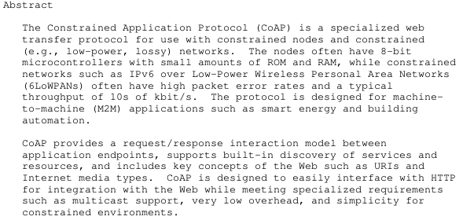

// write by lnfromnorth

# CoAP Protocol

CoAP: Constrained Application Protocol (受限应用协议)

## 简介 (Abstract)



> 适用于 ROM 与 RAM 资源受限的硬件之间的网络通讯协议，是一种机器与机器之间 (M2M) 的通讯协议
 (M2M)。 

> CoAP 提供一种请求响应交互模型 (request/response interaction model) 在各个终端之间，支持内建搜索服务 (build-in discovery of services) 和包含网络关键层面的服务比如 URIs 和 网络媒介类型。

> 一种面向 HTTP 接口的多支持、低开销并且对于受限平台非常的简单。

## 介绍 (Introduce)

### 特性 (Features)

- 受限环境机器之间的完整的 Web 协议
- UDP 绑定选项实现对于单一和多个请求的支持
- 同步信息交换
- 较低的开销和解析复杂度
- URI 和 Content-type 支持
- 简单代理和缓存容量
- 无状态 HTTP 映射，允许代理构建提供许可到 CoAP 相应路径
- 安全绑定到 DTLS

### 术语 (Terminology)

## CoAP

> 定义了四种消息类型： Confirmable, Non-confirmable, acknowledgement, reset

### 网络结构图

```
+------------------------+
|       Application      |
+------------------------+
+------------------------+   \
|    Requests/Responses  |   |
|------------------------|   |  CoAP
|         Messages       |   |
+------------------------+   /
+------------------------+
|           UDP          |
+------------------------+
```
### 消息模型 (Messaging Model)

> 使用短的固定长度的二进制头部 (head) 后边跟着简单的选项 (options) 和载荷 (payload)

> 每个消息有一个包含一个标识 (Message ID) 用来检测重复，并且检测选项的可靠性 (16bit)

- Confirmable
> 通过将一个消息设置成为需要回复来保证可靠性，使用默认的超时时间和指数退避来进行，直到收方发出 ACK 相应为止。
> 当目标不能发出一个对应的内容，则发出 RST 进行回应

- Non-confirmable
> 发出一个不需要回应的数据，比如传感器数据，当目标不能处理的时候返回 RST 进行回应

```
 Client                  Server
   |                       |
   |   CON/NON [0xXXXX]    |
   +---------------------->|
   |                       |
   |   ACK/RST [0xXXXX]    |
   |<----------------------+
   |                       |
```

### 请求响应模型 (Request/Response Model)

> 请求响应内容包含在消息中，分别包含方法代码或响应代码。选项请求和响应信息使用选项进行携带。
> Token 用来独立匹配响应和请求， 是独立于 Message ID 的概念。
> 请求响应机制通过使用 Token 以及消息模型进行传输响应的内容，当 Server 无法回复的使用，会回复一个空包，由此说明数据内容还没有准备好。等到准备好发送一个 CON 消息进行传输相应的内容。
> 如果Clinet 发送 NON 无回复消息，Server 同样返回一个 NON 消息进行回复。

```
 Client                  Server
   |                       |
   |   CON/NON [0xXXXX]    |
   |      GET /XXXXXX      |
   |     (Token 0xXX)      |
   +---------------------->|
   |                       |
   |   ACK/NON [0xXXXX]    |
   |     X.XX Content      |
   |     (Token 0xXX)      |
   |      "XXXXXXXX"       |
   |<----------------------+
   |                       |
```

### 中介和缓存 (intermediaries and caching)

### 资源发现 (Resource Discovery)

## 消息格式 (Message Format)

> 由固定的 4Byte 头部开始，后边由自由长度的 Token 和 Option 和 Payload 组成

```
 0               1               2               3
 0 1 2 3 4 5 6 7 0 1 2 3 4 5 6 7 0 1 2 3 4 5 6 7 0 1 2 3 4 5 6 7 
+-+-+-+-+-+-+-+-+-+-+-+-+-+-+-+-+-+-+-+-+-+-+-+-+-+-+-+-+-+-+-+-+
|Ver| T |  TKL  |      Code     |          Message ID           |
+-+-+-+-+-+-+-+-+-+-+-+-+-+-+-+-+-+-+-+-+-+-+-+-+-+-+-+-+-+-+-+-+
|   Token (if any, TKL bytes) ...
+-+-+-+-+-+-+-+-+-+-+-+-+-+-+-+-+-+-+-+-+-+-+-+-+-+-+-+-+-+-+-+-+
|   Options (if any) ...
+-+-+-+-+-+-+-+-+-+-+-+-+-+-+-+-+-+-+-+-+-+-+-+-+-+-+-+-+-+-+-+-+
|1 1 1 1 1 1 1 1|    Payload (if any) ...
+-+-+-+-+-+-+-+-+-+-+-+-+-+-+-+-+-+-+-+-+-+-+-+-+-+-+-+-+-+-+-+-+
```
- 头部 (head)
    - 版本 (Ver): 2-bit 指示版本数字，必须设置成为 01，其他数字被保留，使用则被遗弃。
    - 类型 (T): 2-bit 指示消息类型
        - 00 - Confirmable
        - 01 - Non-confirmable
        - 10 - Acknowledgement
        - 11 - Reset
    - Token 长度 (TKL): 4-bit 指示可变长度 Token 长度，允许 0-8， 9-15 被保留，否则返回错误
    - 代码 (Code): 8-bit 分为 3 位组 (class) 和 5 位细节 (detail), 0.00 空包
        - 组 (class)
            - 000 - request
            - 010 - success response
            - 100 - clinet error response
            - 101 - server error response
    - 消息标识 (Message ID): 16-bit 用于检测副本和对应消息
- Token
    - 0 - 8 字节长，由 TKL 字段指定，用于关联请求和响应。
- 选项 (Option)
    - 由不定个数的 option 组成，后边跟着消息或者另一个 option 或者 payload 的掩码
- 载荷 (Payload)
    - 前边跟着一个 0xff 的掩码，指示二者之间的分隔，指示数据包长度，没有掩码说明是一个空包，一个有掩码没有载荷的包返回错误。

### 选项格式 (Option Format)

#### Option Format
```
   0  1  2  3     4  5  6  7
+--------------+---------------+
|              |               |
| Option Delta | Option Length |   1 byte
|              |               |
+--------------+---------------+
\                              \
/       Option Delta           /    0-2 bytes
\        (extended)            \
+------------------------------+
\                              \
/       Option Length          /    0-2 bytes
\        (extended)            \
+------------------------------+
\                              \
/                              /
\                              \
/        Option Value          /    0 or more bytes
\                              \
/                              /
\                              \
+------------------------------+
```

- Option Delta: 4-bit 0-12 指示 option delta，保留三个值。
    - 13: 指示 -13
    - 14: 指示 -269
    - 15: 对于载荷掩码进行保留，不使用。
- Option Length: 4-bit 0-12 指示选项值，保留三个值。
    - 13: 同上
    - 14: 同上
    - 15: 同上

### 选项值格式 (Option Value Formats)

- empty: 0 长度序列
- opaque: 不透明序列
- uint: 非负整数
- string

## 消息传输 (Message Transmission)

